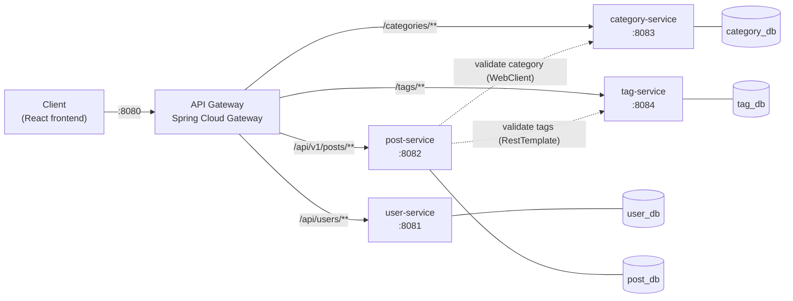

# Blog Platform — Microservices Backend

A blogging backend built as **5 independently deployable Spring Boot services** behind a **Spring Cloud Gateway**, each owning its own **PostgreSQL** database, secured with **stateless JWT authentication**, and started with a single `docker compose up`.


---

## Highlights

- **Microservice architecture** — user, post, category and tag services, each with its own database (database-per-service), plus an API gateway as the single entry point.
- **19 REST endpoints** across 4 domain services, routed through 4 gateway routes with centralized CORS.
- **Stateless JWT auth** — BCrypt-hashed passwords, HMAC-SHA signed tokens with a 1-hour expiry, validated independently in every service (no shared session state).
- **Service-to-service validation** — when a post is created, the post service forwards the caller's JWT to the category and tag services to verify that the category and tags exist before saving.
- **Ownership-based authorization** — only a post's author can edit or delete it; drafts are visible only to their author.
- **Containerized** — multi-stage Dockerfiles for all 5 services; `docker compose` brings up 9 containers (5 services + 4 databases).
- **Tested** — JUnit 5 + Mockito unit tests for business logic and JWT security; Spring context tests run against in-memory H2, so the suite needs no Docker or Postgres.

---

## Architecture



| Service | Port | Gateway route | Responsibility |
|---|---|---|---|
| `api-gateway` | 8080 | — | Single entry point, path-based routing, CORS |
| `user-service` | 8081 | `/api/users/**` | Registration, login, JWT issuing |
| `post-service` | 8082 | `/api/v1/posts/**` | Posts, drafts, publishing, reading time |
| `category-service` | 8083 | `/categories/**` | Category CRUD |
| `tag-service` | 8084 | `/tags/**` | Tag CRUD and bulk tag validation |

### How authentication works

1. `POST /api/users/login` checks the email and BCrypt-hashed password and returns a signed JWT (subject = user's email, valid for 1 hour).
2. The client sends `Authorization: Bearer <token>` on every protected request.
3. Each service validates the token's signature and expiry itself using the shared `JWT_SECRET` — there is no call back to the user service and no server-side session.
4. For inter-service calls (post → category/tag), the post service forwards the caller's token so downstream services apply the same rules.

### Frontend

A companion JavaScript frontend talks only to the API gateway: it logs users in through the user service, stores the JWT on the client, and sends it with every protected request (CORS is configured for `http://localhost:5173`).

---

## Tech stack

| Layer | Technology |
|---|---|
| Language | Java 21 |
| Framework | Spring Boot 3.5 (Web, Data JPA, Validation, Security) |
| Gateway | Spring Cloud Gateway (reactive) |
| Auth | JJWT 0.11.5, BCrypt |
| Service calls | Spring WebClient, RestTemplate |
| Database | PostgreSQL 16 (one per service), Hibernate |
| Testing | JUnit 5, Mockito, AssertJ, H2 |
| Build / deploy | Maven Wrapper, multi-stage Docker builds, Docker Compose |

---

## Getting started

### Prerequisites
- Docker and Docker Compose
- (For running tests or services outside Docker) JDK 21

### 1. Configure secrets

Secrets are read from a git-ignored `.env` file — nothing sensitive is committed.

```bash
cp .env.example .env
```

Then edit `.env`:

```env
POSTGRES_USER=postgres
POSTGRES_PASSWORD=choose-a-password
JWT_SECRET=a-long-random-string-of-at-least-32-characters   # e.g. openssl rand -base64 48
```

### 2. Start everything

```bash
docker compose up --build
```

The gateway is available at **http://localhost:8080**. Compose will refuse to start if `POSTGRES_PASSWORD` or `JWT_SECRET` is missing.

### 3. Try it out

```bash
# Register
curl -X POST http://localhost:8080/api/users/register \
  -H "Content-Type: application/json" \
  -d '{"name":"Rick","email":"rick@example.com","password":"secret123"}'

# Log in and copy the token from the response
curl -X POST http://localhost:8080/api/users/login \
  -H "Content-Type: application/json" \
  -d '{"email":"rick@example.com","password":"secret123"}'

TOKEN="<paste token here>"

# Create a category and a tag
curl -X POST http://localhost:8080/categories \
  -H "Authorization: Bearer $TOKEN" -H "Content-Type: application/json" \
  -d '{"name":"Java"}'

curl -X POST http://localhost:8080/tags \
  -H "Authorization: Bearer $TOKEN" -H "Content-Type: application/json" \
  -d '{"name":"spring-boot"}'

# Publish a post (use the ids returned above)
curl -X POST http://localhost:8080/api/v1/posts \
  -H "Authorization: Bearer $TOKEN" -H "Content-Type: application/json" \
  -d '{"title":"Hello microservices","content":"My first post on the platform.","categoryId":"<category-id>","tagIds":["<tag-id>"],"status":"PUBLISHED"}'

# Read published posts (public)
curl http://localhost:8080/api/v1/posts
```

---

## API reference

All requests go through the gateway on port `8080`. 🔒 = requires `Authorization: Bearer <token>`.

### Users — `user-service`
| Method | Path | Auth | Description |
|---|---|---|---|
| POST | `/api/users/register` | — | Create an account (`name`, `email`, `password`) |
| POST | `/api/users/login` | — | Returns `{ token, expiresIn }` |
| GET | `/api/users/{id}` | 🔒 | Get a user's public profile |

### Posts — `post-service`
| Method | Path | Auth | Description |
|---|---|---|---|
| GET | `/api/v1/posts?categoryId=` | — | Published posts, optionally filtered by category |
| GET | `/api/v1/posts/by-id/{id}` | — | Single post with category, reading time and `editable` flag |
| GET | `/api/v1/posts/drafts` | 🔒 | The current user's drafts |
| POST | `/api/v1/posts` | 🔒 | Create a post (category and tags are validated against their services) |
| PUT | `/api/v1/posts/{id}` | 🔒 | Update — author only |
| DELETE | `/api/v1/posts/{id}` | 🔒 | Delete — author only |

Post body: `title` (min 5 chars), `content` (10–50,000 chars), `categoryId`, `tagIds`, `status` (`DRAFT` \| `PUBLISHED`).
Reading time is estimated at 200 words per minute (minimum 1 minute).

### Categories — `category-service`
| Method | Path | Auth | Description |
|---|---|---|---|
| GET | `/categories` | — | List categories |
| GET | `/categories/{id}` | — | Get a category |
| POST | `/categories` | 🔒 | Create a category |
| PUT | `/categories/{id}` | 🔒 | Rename a category |
| DELETE | `/categories/{id}` | 🔒 | Delete a category |

### Tags — `tag-service`
| Method | Path | Auth | Description |
|---|---|---|---|
| GET | `/tags` | — | List tags |
| GET | `/tags/{id}` | — | Get a tag |
| POST | `/tags` | 🔒 | Create a tag (names are unique) |
| POST | `/tags/validate` | — | Check that a list of tag ids exists (used by post-service) |
| DELETE | `/tags/{id}` | 🔒 | Delete a tag |

---

## Running the tests

Each service is its own Maven project. From a service folder:

```bash
./mvnw test          # macOS / Linux
mvnw.cmd test        # Windows
```

Tests use an in-memory H2 database (`src/test/resources/application.properties`), so no Docker or Postgres is needed.

| Service | What is covered |
|---|---|
| user-service | Password hashing, duplicate-email rejection (409), login/token issuing, JWT expiry, forged and foreign-signed tokens rejected |
| post-service | Category/tag validation before save, author-only edit/delete, draft visibility, `editable` flag, reading-time calculation |
| category-service | CRUD and not-found handling |
| tag-service | Duplicate names, bulk tag validation, JWT filter (valid, missing, wrong-secret and expired tokens) |

---

## Project structure

```
blog-microservices-backend/
├── api-gateway/          # Spring Cloud Gateway — routing + CORS
├── user-service/         # accounts, login, JWT issuing
├── post-service/         # posts + clients for category/tag services
├── category-service/
├── tag-service/
├── docker-compose.yml    # 5 services + 4 PostgreSQL databases
└── .env.example          # template for local secrets
```

Each service follows a layered layout: `controller → service → repository`, with DTOs separating the API from JPA entities and a `security/` package holding its JWT filter and security config.

---

## Deployment

- **user-service** has been deployed on [Render](https://render.com) as a Docker web service, configured entirely through environment variables.
- The other services are deployable the same way (each has its own multi-stage Dockerfile and reads all config from the environment) but currently run locally via Docker Compose because of free-tier limits.

---

## Design decisions

- **Database per service** — services never share tables; they reference each other only by id (e.g. a post stores `categoryId`), which keeps them independently deployable.
- **Token validation in every service** — each service can verify requests on its own, so a service can be exposed or scaled without depending on the user service being up.
- **Synchronous validation on write** — the post service verifies category and tag ids at creation time, trading a little latency for never storing dangling references.

## Roadmap

- Global exception handling so not-found and forbidden cases return 404/403 instead of 500
- Batch-fetch categories and populate tags in post listings (avoid one call per post)
- Service discovery (Eureka) and resilience (Resilience4j circuit breakers) for inter-service calls
- Enforce authentication at the gateway and add role-based access for category/tag management
- Integration tests with Testcontainers and a CI pipeline (GitHub Actions)
